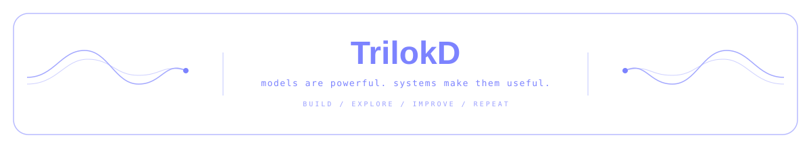

<div align="center">


### Building production AI systems beyond the model API.

**LLMs · Multimodal AI · AI Infrastructure · Model Orchestration**

</div>

## About

I'm an **AI/ML Engineer & AI Team Lead** focused on building production-grade **Generative AI systems**.

I work across the full AI application layer — combining **LLMs, vision, speech, image/video generation and backend infrastructure** into reliable product experiences.

My focus is moving AI from **`prototype → production`**.

## What I Build

* 🧠 **Generative AI Applications** — LLM-powered product workflows and intelligent features
* 👁️ **Multimodal AI Systems** — vision, speech, image and video generation pipelines
* ⚡ **AI Infrastructure** — scalable APIs, workload orchestration, queues and stateful processing
* 🧩 **Model Orchestration** — prompt systems, structured outputs, validation and multi-model workflows
* 🏗️ **Production AI Architecture** — reliability, observability and failure-aware system design

## Stack

<div align="center">


<br><br>


</div>

## Currently

```text
Building        → Production Generative AI systems
Exploring       → Multimodal & model-orchestrated workflows
Engineering     → Reliable AI infrastructure
Leading         → AI engineering projects & developers
```

---

<div align="center">

### `models are powerful. systems make them useful.`

<p align="center">
  
</p>

</div>
